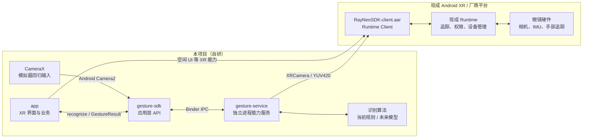

# 项目与现成 Android XR 平台的关系

```mermaid
flowchart LR
    subgraph Project["本项目（自研）"]
        Camera["CameraX<br/>模拟器回归输入"]
        App["app<br/>XR 界面与业务"]
        GestureSdk["gesture-sdk<br/>应用层 API"]
        Service["gesture-service<br/>独立进程能力服务"]
        Engine["识别算法<br/>当前规则 / 未来模型"]

        Camera -->|"Android Camera2"| GestureSdk
        App <-->|"recognize / GestureResult"| GestureSdk
        GestureSdk <-->|"Binder IPC"| Service
        Service <--> Engine
    end

    subgraph Platform["现成 Android XR / 厂商平台"]
        ExistingSdk["RayNeoSDK-client.aar<br/>Runtime Client"]
        Runtime["现成 Runtime<br/>追踪、权限、设备管理"]
        Hardware["眼镜硬件<br/>相机、IMU、手部追踪"]

        ExistingSdk <--> Runtime
        Runtime <--> Hardware
    end

    App -->|"空间 UI 等 XR 能力"| ExistingSdk
    Service -->|"XRCamera / YUV420"| ExistingSdk
```

关键点：应用只调用 `gesture-sdk`；`gesture-service` 持有 Runtime 客户端与摄像头。当前
先验证 Runtime 是否持续返回真实 YUV420 帧，不修改或合并现成 Runtime。
